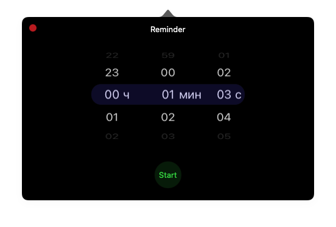
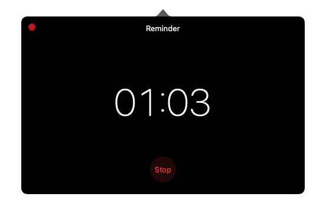

# Reminder

A minimalist macOS menu bar countdown timer. Set a time using a unique drum-roll-style picker, and the app lives quietly in the menu bar until it's time. When the timer expires, notifications repeat until you dismiss them.

<p float="left">
  
  
</p>

## Features

**Drum roll time picker** — scroll through hours, minutes, and seconds with a smooth drum-roll wheel. Unlike conventional dropdowns or steppers, this picker makes setting a timer feel tactile and fast. The library ([DrumrollTimePicker](https://github.com/OneEuro/DrumrollTimePicker.git)) is macOS-native and doesn't exist in competing menu bar timers.

**Repeating notifications** — when the timer goes off, the notification repeats every N seconds (configurable in Settings) until you tap "Stop". You don't miss it even if you're away from your desk.

**Minimal interface** — the entire app lives in a compact popover: pick a time, press Start, go about your work. During the countdown, only a large monospaced timer is shown — no distractions.

## Settings

Right-click the menu bar icon to open Settings.

| Setting | Description |
|---|---|
| **Infinite scroll** | When enabled, the picker doesn't stop at 0 or 59 — it wraps around continuously. |
| **Invert scroll direction** | Reverses the scroll direction of the picker wheels (natural / iOS-style vs traditional). |
| **Notification repeat interval** | How often (in seconds) the notification repeats while the timer has expired. Set to 0 to disable repeating. |

## Requirements

- macOS 14.0+
- Apple Silicon or Intel Mac

## Installation

Download the latest `Reminder.app` from Releases, or build from source:

```bash
git clone <repo-url>
cd Reminder
xcodebuild -project Reminder.xcodeproj -scheme Reminder build
```

The built app will be in `DerivedData/Reminder-*/Build/Products/Debug/Reminder.app`.

## Architecture

- **VIPER** architecture
- **AppKit**, no Storyboard (manual `NSApplication` launch via `main.swift`)
- **Sandboxed**
